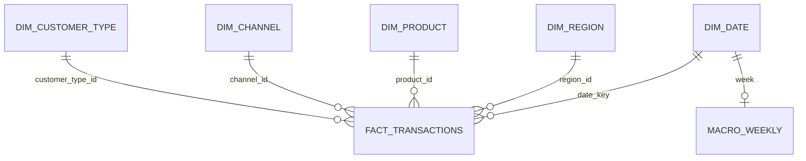

# Проектирование решения

## 1.0. Исходные данные и качество

В наборе два CSV: `building_materials_transactions.csv` (340 000 строк за период с 2019-01-07 по 2024-12-30, 15 полей) и `macro_drivers_weekly.csv` (313 недель, четыре показателя). Описание полей приведено в `data_dictionary_materials.csv`. Источник продаж: [US Building Materials Sales Transactions 2019-2024](https://www.kaggle.com/datasets/sergionefedov/us-building-materials-sales-transactions-20192024).

Продажа описывается датой недели, регионом, SKU, каналом и типом клиента; товарная категория относится к SKU. Количество, цена и выручка являются мерами. Макропоказатели относятся к неделе и повторяются во всех продажах этой недели. Связь макроданных с продажами — `date/week` (1:N). Возможные риски исходной структуры: неверные типы и даты, несовпадение года/месяца/ISO-недели, дубли, пустые бизнес-ключи, отрицательные значения, некорректная формула выручки, разрыв недель, несогласованные категории для одного SKU и повтор макропоказателей в строках факта. В исходных файлах пустых значений не найдено.

Комбинация `date, region, SKU, channel, customer_type` не уникальна: найдено 60 сочетаний, для которых различаются количество или цена. В исходных данных нет ID сделки, поэтому технический ключ строится из имени файла и номера строки. Он позволяет повторно загрузить файл и обновить исправленную строку, если её имя и положение не изменились. При переименовании или сортировке файла такой ключ ненадёжен; для производственного источника нужен собственный ID сделки. Удаление строки из файла также не удаляет ранее загруженный факт — для этого нужна отдельная политика синхронизации снимка.

## 1.1. Архитектура и схема

Используется локальное реляционное аналитическое хранилище: звезда фактов с нормализованными справочниками. `fact_transactions` ссылается на `dim_date`, `dim_region`, `dim_product`, `dim_channel`, `dim_customer_type`; `macro_weekly.week` также ссылается на календарную дату и хранит недельные внешние показатели. Внешние показатели продублированы в факте как срез значений из исходного файла транзакций, чтобы воспроизводить его исходное содержание; при аналитических запросах предпочтителен `macro_weekly`.

Справочники хранят текстовые атрибуты один раз, а факт — меры и ссылки на них. Это звёздная схема с нормализованными измерениями. Строгая 3НФ сократила бы дублирование, но добавила бы соединения в аналитические запросы. Широкая денормализация упростила бы чтение, но повторяла бы описательные поля в каждой продаже. Для этого набора SQLite удобна тем, что работает локально и не требует отдельного сервера. При нескольких одновременных писателях лучше подойдёт PostgreSQL; при больших аналитических сканированиях — колонночная СУБД.

### Таблицы, поля и связи

| Таблица | Поля и смысл | Ключи |
| --- | --- | --- |
| `dim_date` | `date_key` — понедельник недели; `year`, `month`, `week_of_year` — календарные атрибуты | `date_key` — PK |
| `dim_region` | `region` — регион продаж | `region_id` — PK; `region` — UNIQUE |
| `dim_product` | `sku`, `product_category` — товар и его категория | `product_id` — PK; `sku` — UNIQUE |
| `dim_channel` | `channel` — канал продаж | `channel_id` — PK; `channel` — UNIQUE |
| `dim_customer_type` | `customer_type` — тип клиента | `customer_type_id` — PK; `customer_type` — UNIQUE |
| `macro_weekly` | `week`, `housing_starts_index`, `lumber_price_index`, `mortgage_rate`, `season_factor` | `week` — PK и FK на `dim_date.date_key` |
| `fact_transactions` | `transaction_key`; ссылки на дату, регион, товар, канал и тип клиента; меры `units`, `unit_price`, `revenue`; макросрез и источник | `transaction_key` — PK; пять FK на измерения |
| `rejected_rows` | имя файла, номер строки, исходная запись JSON, причина и время отклонения | `reject_id` — PK; уникальность источника, строки и содержимого |

У каждой строки продаж ровно одна дата, регион, товар, канал и тип клиента; каждый элемент этих справочников может встречаться во многих продажах. Для одной календарной недели хранится не более одной строки `macro_weekly`. Внешний ключ не позволяет записать макронеделю, которой нет в календаре продаж.

### Обоснование нормализации

Измерения отделены от факта, поэтому названия регионов, товаров, каналов и типов клиентов не дублируются в каждой продаже. Это уменьшает риск расхождения написания атрибутов. Категория хранится рядом с SKU в `dim_product`; отдельное измерение категорий имеет смысл добавить, когда у категорий появятся собственные атрибуты.

Факт устроен как звезда: аналитический запрос группирует меры по внешним ключам, обычно с небольшим числом соединений. Макропоказатели хранятся и в факте, и в `macro_weekly`: факт сохраняет недельный срез источника, отдельная таблица даёт единое значение на неделю. Цена этого решения — дублирование и риск расхождения; в текущих исходных файлах расхождений нет. Строгая нормализация убрала бы макрополя из факта, но потребовала бы соединять факт с `macro_weekly` в запросах. Полностью широкая денормализованная таблица упростила бы запросы, но многократно повторяла бы текстовые измерения и макропоказатели.

## 1.2. Выбор СУБД

Для этого проекта выбрана SQLite: не нужен отдельный сервер, база создаётся обычным запуском Python, поддерживаются внешние ключи, индексы, транзакции и UPSERT. PostgreSQL лучше подходит для сетевого сервиса с несколькими писателями и ролями, но требует настройки сервера. DuckDB удобна для локальной аналитики больших CSV/Parquet, однако не рассчитана на ту же многопользовательскую запись, что PostgreSQL.

| СУБД | Преимущества | Недостатки | Когда выбрать |
| --- | --- | --- | --- |
| SQLite — выбрана | Нет отдельного сервера; стандартная библиотека Python; транзакции, FK и UPSERT | Ограниченная конкурентная запись и серверное администрирование | Автономное задание, локальная обработка этого объёма |
| PostgreSQL | Многопользовательская работа, роли, сетевые подключения и развитая серверная эксплуатация | Нужны установка, конфигурация и сопровождение сервера | Общий сервис с несколькими писателями |
| DuckDB | Сильная локальная аналитика по CSV/Parquet и большим сканируемым наборам | Не является типичным сервером многопользовательской OLTP-записи | Аналитические нагрузки и пакетные исследования |

Для автономного запуска этого проекта достаточно SQLite. Если хранилищем начнут одновременно пользоваться несколько процессов или пользователей, стоит перейти на PostgreSQL. Для крупных пакетных аналитических запросов можно рассмотреть DuckDB или колонночное хранилище.

## 1.3. Слои ETL

Три логических слоя:

1. **Source:** исходные CSV остаются неизменными и служат повторяемым входом.
2. **Validated/staging:** строки потоково читаются как словари строк; после разбора — как типизированные словари Python. Отдельную постоянную staging-таблицу не создаём: преобразования просты и каждая строка обрабатывается сразу. Плохие строки остаются в `rejected_rows` вместе с исходным JSON и причиной.
3. **Warehouse:** проверенные значения загружаются в измерения, недельный макросправочник и факт продаж.

Последовательность преобразований: проверка заголовков → разбор дат и чисел → проверка календарных полей и диапазонов → проверка `revenue ≈ units × unit_price` → вычисление идентификатора источника/строки → получение ключей измерений → UPSERT целевых записей. Всё выполняется в одной транзакции: критическая ошибка отменяет запуск, а ошибка отдельной строки изолируется.

## 2.1–2.2. Реализация и инкременты

`etl.py` читает CSV, проверяет заголовки, даты, типы, диапазоны и равенство `revenue ≈ units × unit_price`, после чего загружает измерения и продажи. Справочники и недельные макропоказатели обновляются через UPSERT. Ключ по имени файла и номеру строки предотвращает дубли при повторном запуске и позволяет обновить исправленную запись на прежней позиции. Одна транзакция охватывает весь запуск.

## 3.1. Отказоустойчивость и проверки

Ошибочные записи сохраняются в `rejected_rows`, уникальность источника/строки/содержимого исключает повторные записи ошибки при повторном запуске. Исключения структуры файла или базы данных считаются критическими и откатывают транзакцию. Тесты проверяют неверную выручку, изоляцию плохой строки рядом с корректной, идемпотентность, исправление исторической строки, rollback при неверном заголовке и карантин макронедели без даты в календаре. Запуск тестов: `python -m unittest discover -s tests -v`.

## 3.2. Документирование и запуск

Структура и инструкции находятся в `README.md`; основные функции `etl.py` снабжены докстрингами. Из корня проекта пайплайн запускается командой `python etl.py`. Пути задаются через `--transactions`, `--macro` и `--database`.
