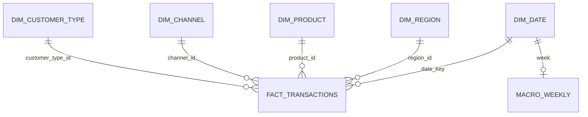

# Проектирование решения

## 1.0. Исходные данные и качество

В репозитории поставлены два CSV: `building_materials_transactions.csv` (340 000 строк, недели с 2019-01-07 по 2024-12-30, 15 полей) и `macro_drivers_weekly.csv` (313 недель, пять показателей). Словарь полей находится в `data_dictionary_materials.csv`. Данные Kaggle уже присутствуют локально; ссылка на первоисточник: [US Building Materials Sales Transactions 2019-2024](https://www.kaggle.com/datasets/sergionefedov/us-building-materials-sales-transactions-20192024).

Продажа описывается датой недели, регионом, SKU, каналом и типом клиента; товарная категория относится к SKU. Количество, цена и выручка являются мерами. Макропоказатели относятся к неделе и повторяются во всех продажах этой недели. Связь макроданных с продажами — `date/week` (1:N). Возможные риски исходной структуры: неверные типы и даты, несовпадение года/месяца/ISO-недели, дубли, пустые бизнес-ключи, отрицательные значения, некорректная формула выручки, разрыв недель, несогласованные категории для одного SKU и повтор макропоказателей в строках факта. В поставленном файле нет пустых значений; 60 групп повторяют предполагаемые измерения `date, region, SKU, channel, customer_type`, но строки различаются по количеству/цене, поэтому этот набор не является ключом сделки.

Проверки в ETL не полагаются на неподтвержденную уникальность набора измерений. Источник не имеет ID сделки, поэтому применен SHA-256 пары `source filename + CSV line number`: он различает повторяющиеся измерения и позволяет обновить исправленную историческую строку, если сохраняются имя файла и порядок его строк. Повторная загрузка идемпотентна. Для смены формата выгрузки или произвольной перестановки строк понадобится настоящий ID источника либо отдельная таблица соответствия ключей. Удаление строки из файла само по себе не удаляет факт: для синхронизации снимка нужна явная политика удаления.

## 1.1. Архитектура и схема

Используется локальное реляционное аналитическое хранилище: звезда фактов с нормализованными справочниками. `fact_transactions` ссылается на `dim_date`, `dim_region`, `dim_product`, `dim_channel`, `dim_customer_type`; `macro_weekly.week` также ссылается на календарную дату и хранит недельные внешние показатели. Внешние показатели продублированы в факте как срез значений из исходного файла транзакций, чтобы воспроизводить его исходное содержание; при аналитических запросах предпочтителен `macro_weekly`.

Справочники исключают повтор текстовых атрибутов в каждой строке, а факт содержит числовые меры и внешние ключи. Это практический компромисс: измерения нормализованы, факт устроен как звезда ради простоты и скорости группировок. Жесткая 3НФ для всех сущностей минимизировала бы дублирование, но увеличила число соединений и усложнила аналитику; широкая денормализация упростила бы чтение, но размножала бы атрибуты. При неизменном масштабе файла 38 МБ SQLite обеспечивает переносимость и транзакционность; при конкурентной многопользовательской работе или росте объема целевой сервер — PostgreSQL, а для очень больших сканируемых фактов — колонночное хранилище.

### Таблицы, поля и связи

| Таблица | Поля и смысл | Ключи |
| --- | --- | --- |
| `dim_date` | `date_key` — понедельник недели; `year`, `month`, `week_of_year` — календарные атрибуты | `date_key` — PK |
| `dim_region` | `region` — регион продаж | `region_id` — PK; `region` — UNIQUE |
| `dim_product` | `sku`, `product_category` — товар и его категория | `product_id` — PK; `sku` — UNIQUE |
| `dim_channel` | `channel` — канал продаж | `channel_id` — PK; `channel` — UNIQUE |
| `dim_customer_type` | `customer_type` — тип клиента | `customer_type_id` — PK; `customer_type` — UNIQUE |
| `macro_weekly` | `week`, `housing_starts_index`, `lumber_price_index`, `mortgage_rate`, `season_factor` | `week` — PK и FK на `dim_date.date_key` |
| `fact_transactions` | `transaction_key`; ссылки на дату, регион, товар, канал и тип клиента; меры `units`, `unit_price`, `revenue`; макросрез и источник | `transaction_key` — PK; пять FK на измерения |
| `rejected_rows` | имя файла, номер строки, исходная запись JSON, причина и время отклонения | `reject_id` — PK; уникальность источника, строки и содержимого |

У каждой строки продаж ровно одна дата, регион, товар, канал и тип клиента; каждый элемент этих справочников может встречаться во многих продажах. Для одной календарной недели хранится не более одной строки `macro_weekly`. Внешний ключ не позволяет записать макронеделю, которой нет в календаре продаж.

### Обоснование нормализации

Измерения отделены от факта, поэтому названия регионов, товаров, каналов и типов клиентов не дублируются в каждой продаже. Это уменьшает риск расхождения написания атрибутов. Категория хранится рядом с SKU в `dim_product`; отдельное измерение категорий имеет смысл добавить, когда у категорий появятся собственные атрибуты.

Факт устроен как звезда: аналитический запрос группирует меры по внешним ключам, обычно с небольшим числом соединений. Макропоказатели хранятся и в факте, и в `macro_weekly`: факт сохраняет недельный срез источника, отдельная таблица даёт единое значение на неделю. Цена этого решения — дублирование и риск расхождения; в текущих исходных файлах расхождений нет. Строгая нормализация убрала бы макрополя из факта, но потребовала бы соединять факт с `macro_weekly` в запросах. Полностью широкая денормализованная таблица упростила бы запросы, но многократно повторяла бы текстовые измерения и макропоказатели.

## 1.2. Выбор СУБД

Выбран SQLite для демонстрационного локального ETL: не нужен отдельный сервер, доступна стандартная библиотека Python, есть внешние ключи, индексы, ACID-транзакции и UPSERT. PostgreSQL предпочтительнее для нескольких писателей, ролей, сетевого сервиса, параллельных нагрузок и управляемых резервных копий, но требует развертывания. DuckDB отлично подходит для локальной аналитики и крупных CSV/Parquet, но не так естественен как многопользовательская OLTP-база.

| СУБД | Преимущества | Недостатки | Когда выбрать |
| --- | --- | --- | --- |
| SQLite — выбрана | Нет отдельного сервера; стандартная библиотека Python; транзакции, FK и UPSERT | Ограниченная конкурентная запись и серверное администрирование | Автономное задание, локальная обработка этого объёма |
| PostgreSQL | Многопользовательская работа, роли, сетевые подключения и развитая серверная эксплуатация | Нужны установка, конфигурация и сопровождение сервера | Общий сервис с несколькими писателями |
| DuckDB | Сильная локальная аналитика по CSV/Parquet и большим сканируемым наборам | Не является типичным сервером многопользовательской OLTP-записи | Аналитические нагрузки и пакетные исследования |

Для текущего задания SQLite — самый простой воспроизводимый вариант. Если появятся одновременные записи и удалённые пользователи, выбор сместится к PostgreSQL; если преобладают тяжёлые аналитические сканирования файлов — к DuckDB или колонночному хранилищу.

## 1.3. Слои ETL

Три логических слоя:

1. **Source:** исходные CSV остаются неизменными и служат повторяемым входом.
2. **Validated/staging:** строки потоково читаются как словари строк; после разбора — как типизированные словари Python. Отдельную постоянную staging-таблицу не создаём: преобразования просты и каждая строка обрабатывается сразу. Плохие строки остаются в `rejected_rows` вместе с исходным JSON и причиной.
3. **Warehouse:** проверенные значения загружаются в измерения, недельный макросправочник и факт продаж.

Последовательность преобразований: проверка заголовков → разбор дат и чисел → проверка календарных полей и диапазонов → проверка `revenue ≈ units × unit_price` → вычисление идентификатора источника/строки → получение ключей измерений → UPSERT целевых записей. Всё выполняется в одной транзакции: критическая ошибка отменяет запуск, а ошибка отдельной строки изолируется.

## 2.1–2.2. Реализация и инкременты

`etl.py` реализует Extract → Validate/Transform → Load. Он проверяет заголовки, обязательные поля, ISO-понедельники, типы, конечность чисел, согласованность даты и календарных атрибутов, неотрицательные величины и равенство `revenue ≈ units × unit_price`. Дименсии обновляются через UPSERT, недельный макросправочник — по неделе. Ключ по хешу имени файла и номера строки делает повторный запуск идемпотентным и обновляет историческую запись при исправлении строки на прежнем месте. Все изменения запуска выполняются в одной транзакции.

## 3.1. Отказоустойчивость и проверки

Ошибочные записи сохраняются в `rejected_rows`, уникальность источника/строки/содержимого исключает повторные записи ошибки при повторном запуске. Исключения структуры файла или базы данных считаются критическими и откатывают транзакцию. Тесты проверяют неверную выручку, изоляцию плохой строки рядом с корректной, идемпотентность, исправление исторической строки, rollback при неверном заголовке и карантин макронедели без даты в календаре. Запуск тестов: `python -m unittest discover -s tests -v`.

## 3.2. Документирование и запуск

Структура и инструкции находятся в `README.md`; основные функции `etl.py` снабжены докстрингами. Из корня проекта пайплайн запускается командой `python etl.py`. Пути задаются через `--transactions`, `--macro` и `--database`.

## Карта ответов на пункты задания

| Пункт | Где искать ответ или реализацию |
| --- | --- |
| Часть 1, 1.0: состав данных, сущности, связи, проблемы качества | Раздел 1.0 выше и измерения, описанные в схеме |
| Часть 1, 1.1: схема, нормализация/денормализация и аргументы | Раздел 1.1, таблица полей и ER-диаграмма |
| Часть 1, 1.2: выбор СУБД и альтернативы | Раздел 1.2 и таблица сравнения SQLite, PostgreSQL и DuckDB |
| Часть 1, 1.3: слои, структура и преобразования | Раздел 1.3, пункты 1–3 и последовательность преобразований |
| Часть 2, 1.1: извлечение, обработка, загрузка, валидация | `etl.py`: `load_transactions`, `load_macro`, валидаторы и `run_pipeline` |
| Часть 2, 1.2: инкременты, идемпотентность, история | Ключ источника/строки и UPSERT; повторная и исправленная загрузка покрыты тестами |
| Часть 3, 3.1: плохие строки, rollback, тесты | `rejected_rows`, SQLite-транзакция, раздел 3.1 и `tests/test_etl.py` |
| Часть 3, 3.2: README и докстринги | `README.md`, этот раздел и докстринги основных функций `etl.py` |

**Ограничение сдачи:** исходники сейчас находятся локально. В рабочей папке не задан адрес GitHub-репозитория, поэтому публикация не выполнена.
